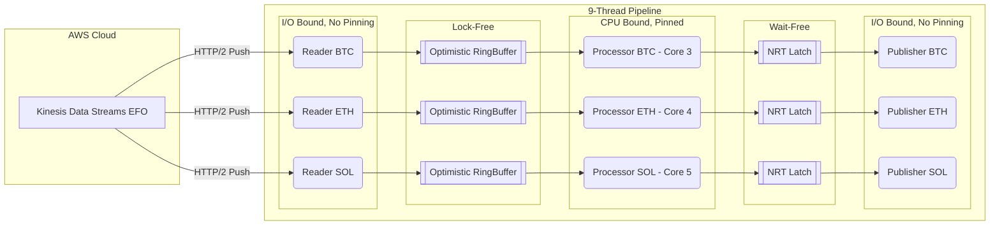

# C++ High-Performance NRT Orderbook Aggregator

## 1. 프로젝트 개요 (Overview)
본 프로젝트는 **AWS Kinesis Data Streams (EFO)**를 통해 수신되는 3개 주요 암호화폐 거래소(Binance, Bybit, OKX)의 오더북 스트림을 **단일 EC2 노드**에서 수집, 병합(Merge), 정렬하여 **글로벌 통합 오더북(Global Snapshot)**을 발행하는 고성능 시스템입니다.

### 핵심 철학: NRT (Near Real-Time)
> **"오래된 완전함보다, 불완전하더라도 최신의 데이터가 가치 있다."**

시스템이 포화 상태일 때 데이터를 큐에 쌓아두어 지연(Lag)을 발생시키는 대신, 과감히 **Drop-Newest / Overwrite** 전략을 사용하여 항상 현재 시점 기준 가장 신선한(Fresh) 시장 데이터를 제공하는 것을 목표로 합니다.

---

## 2. 시스템 아키텍처 (System Architecture)

전체 시스템은 **9-Thread Pipeline** 구조로 설계되었으며, I/O Bound 작업과 CPU Bound 작업을 철저히 분리하여 상호 간섭(Jitter)을 제거했습니다.



### Thread Model
1.  **Reader Threads (3개)**
    * **역할:** AWS Kinesis EFO 비동기 수신, `ShardContext` 생명주기 관리.
    * **전략:** OS 스케줄러 위임 (No Pinning). 대기 시간이 99%이므로 유휴 자원 활용.
2.  **Processor Threads (3개)**
    * **역할:** Protobuf 파싱, 10ms 윈도우잉, 병합/정렬, 스냅샷 생성.
    * **전략:** **CPU Pinning (Core 3, 4, 5)**. Context Switching 비용 제거 및 L1/L2 Cache Hit 극대화.
3.  **Publisher Threads (3개)**
    * **역할:** 최종 병합된 스냅샷 외부 전송.
    * **전략:** OS 스케줄러 위임.

---

## 3. 핵심 기술적 의사결정 (Key Technical Decisions)

### A. 동시성 모델: Optimistic Lock-Free MPSC Ring Buffer
* **문제:** Blocking Queue 사용 시 Reader Blocking 발생 및 전체 파이프라인 지연.
* **해결:**
    * **Wait-Free Writer:** `fetch_add`로 슬롯 인덱스를 선점하여 락 없이 진입.
    * **Optimistic Read (Seqlock):** Reader는 Version을 확인하여 Writer가 덮어쓰는(Overwrite) 중인지 감지하고 재시도.
    * **Overwrite Oldest:** 버퍼가 가득 차면 Reader는 멈추지 않고 가장 오래된 데이터를 덮어씀. (NRT 필수 전략)

### B. I/O 격리: NRT Latch (Single-Slot Buffer)
* **문제:** Processor가 I/O 속도에 종속되면 연산 지연 발생 (I/O Contamination).
* **해결:**
    * Queue가 아닌 **Latch(걸쇠)** 구조 도입.
    * Processor는 연산이 끝나면 무조건 Latch에 최신 스냅샷을 덮어씀(Overwrite).
    * Publisher는 본인의 I/O가 끝난 시점에 Latch에서 가장 최신 스냅샷 하나만 가져감.
    * **Backpressure 완전 제거.**

### C. 안정성: AWS SDK 비동기 핸들러 생명주기 관리
* **Critical Fix:** `SubscribeToShardAsync` 콜백 실행 시 핸들러 객체 파괴로 인한 Virtual Method Call Crash 방지.
* **ShardContext 전략:**
    * `ShardContext` 구조체가 Handler와 Request를 `shared_ptr`로 강하게 소유.
    * 콜백 내부에서는 **Raw Pointer**로 캡처하여 **순환 참조(Circular Reference)**로 인한 메모리 누수 방지.

### D. Micro-Optimization
* **_mm_pause():** Busy-wait 루프 시 CPU 파이프라인을 비워 하이퍼스레딩 형제 코어 리소스 확보.
* **Busy-Wait Read Retry:** RingBuffer Read 시 `NotReady` 상태여도 즉시 포기하지 않고 일정 횟수 재시도하여 처리량 증대.

---

## 4. 튜닝 파라미터 (Tuning Parameters)

| Parameter | Value | Description |
| :--- | :--- | :--- |
| **Window Size** | `10ms` | 데이터 완전성과 처리 오버헤드 간의 최적 타협점. |
| **Watermark Delay** | `Skew P99` | 이벤트 시간과 시스템 시간 차이의 P99 값을 지연 시간으로 설정. |
| **Buffer Capacity** | `200` | P99.9 처리 시간이 9ms 이내가 되도록 튜닝. |

---

## 5. 빌드 및 실행 가이드 (Build & Run)

### 요구 사항 (Prerequisites)
* C++17 이상 (C++20 권장)
* GCC or Clang Compiler
* **AWS SDK for C++** (Kinesis, Core 모듈 필수)
* Google Protobuf

### 빌드 (Build)
```bash
mkdir build && cd build
cmake ..
make -j$(nproc)
```

### 실행 (Run)
```bash
# 실행 시 AWS 자격 증명(~/.aws/credentials) 설정 필요
./my_app
```

---

## 6. 소스 코드 구조 (File Structure)

* **main.cpp**: 9개 스레드 생성, AWS Kinesis 클라이언트 설정, 전체 파이프라인 조율.
* **optimistic_ring_buffer.hpp**: LMAX 스타일 Lock-Free 링 버퍼 구현체.
* **nrt_latch.hpp**: Processor와 Publisher 간의 비동기 데이터 전달을 위한 Latch.
* **aggregator_metrics.hpp**: 지연 시간(Latency) 및 Skew 측정을 위한 히스토그램.
* **common.hpp / clean_data.hpp**: CPU 피닝, 데이터 구조체 및 Protobuf 파서.
* **merged_order_book.hpp**: 통합 오더북 구조체.

---