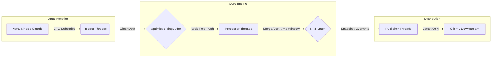

# HFT Aggregator: Lock-Free Orderbook Engine

   

> **High-Frequency Trading (HFT) 환경을 위한 초저지연(Low Latency) 가상화폐 오더북 통합 엔진**
>
> 락(Lock) 기반 동시성 제어에서 발생하는 **Lock Holder Preemption(LHP)** 현상을 해결하기 위해 **Optimistic Lock-Free Ring Buffer**와 **Core Pinning** 전략을 도입하여, Tail Latency를 30ms 이상 단축하고 시스템 안정성을 확보한 프로젝트입니다.

---

## 1. Project Overview

본 프로젝트는 **AWS Kinesis**를 통해 실시간으로 수신되는 3개 거래소(Binance, Bybit, Okx - *Code names: BTC, ETH, SOL*)의 클린 오더북 스트림을 수집, 병합, 정렬하여 하나의 **글로벌 오더북(Global Orderbook)으로** 발행하는 **NRT(Near Real-Time) Aggregation Engine**입니다.

### 💡 Core Contribution: Aggregation Engine (Task 2)
전체 데이터 파이프라인 중 가장 높은 연산 비용과 동시성 제어가 요구되는 **'오더북 통합 엔진(Aggregator)'** 개발을 전담하였습니다.

* **Input:** Normalized Data (`CleanData`) from Kinesis Shards via AWS EFO.
* **Core Logic:** Time-Window based Merge Sort & Watermark Management.
* **Output:** Latest Global Snapshot (`MergedOrderBook`) serving via NRT Latch.

---

## 2. Architecture & Design Strategy

시스템은 극한의 처리 성능을 보장하기 위해 역할별로 스레드를 엄격히 분리한 **9-Thread Pipelining** 구조를 채택했습니다.

### 2.1. Thread Model (9 Threads)

| Stage | Role | Type | Scheduling Strategy |
|:---:|:---|:---:|:---|
| **Reader** (3 Threads) | AWS Kinesis(EFO) 데이터 수신 및 역직렬화 | I/O Bound | OS Default Scheduling |
| **Processor** (3 Threads) | **Time-Window 병합, 정렬, 워터마크 관리** | **CPU Bound** | **Core Pinning (Cores 3, 4, 5)** |
| **Publisher** (3 Threads) | 최신 스냅샷 클라이언트 전송 (Simulated I/O) | I/O Bound | OS Default Scheduling |

* **Core Pinning Strategy:** 핵심 연산을 담당하는 Processor 스레드를 물리 코어에 1:1로 고정(Pinning)하여, **Context Switching 비용과 Cache Miss를 최소화**했습니다.
* **OS Default Scheduling (Reader/Publisher):** I/O 작업 비중이 높은 Reader와 Publisher는 특정 코어에 고정하지 않고 OS 스케줄러에 위임했습니다. 이를 통해 스레드가 대기 상태에서 깨어날 때 **즉시 유휴 코어(Idle Core)로 마이그레이션**되어 실행될 수 있도록 하여, 특정 코어의 일시적 과부하로 인한 병목을 방지하고 I/O 처리 효율을 극대화했습니다.

### 2.2. Pipeline Data Flow

```mermaid
graph LR
    subgraph Data Ingestion
        A[AWS Kinesis Shards] -->|EFO Subscribe| B(Reader Threads)
    end
    
    subgraph Core Engine
        B -->|CleanData| C{Optimistic RingBuffer}
        C -->|Wait-Free Push| D[Processor Threads]
        D -->|Merge/Sort, 7ms Window| E{"NRT Latch"}
    end
    
    subgraph Distribution
        E -->|Snapshot Overwrite| F[Publisher Threads]
        F -->|Latest Only| G[Client / Downstream]
    end
```
## 3. Key Engineering Challenges & Solutions

### 3.1. Problem: Lock Holder Preemption (LHP)
초기 `std::mutex` 기반의 Ring Buffer 사용 시, 간헐적으로 **Tail Latency(P99)가 480ms까지 치솟는 지연 스파이크**가 관측되었습니다.
* **원인 분석:** Writer(Reader Thread)가 락을 획득한 상태에서 OS 스케줄러에 의해 선점(Preemption)당할 경우, 락을 기다리는 Reader(Processor Thread)가 장시간 대기(Stall)하는 현상을 확인했습니다.

### 3.2. Solution: Optimistic Lock-Free Ring Buffer
LHP 문제를 원천 차단하기 위해 **Optimistic Lock-Free** 기법을 적용한 커스텀 Ring Buffer를 구현했습니다.

* **Atomic Index Reservation:** `std::atomic::fetch_add`를 통해 Writer들이 락 없이 고유 인덱스를 즉시 선점 (Wait-Free).
* **Seqlock Versioning:**
    * Writer는 데이터 기입 전후에 `Version`을 업데이트 (Odd: Writing, Even: Committed).
    * Reader는 읽기 전후의 `Version` 일치 여부를 확인하여, 경합 시 재시도(Retry)하는 낙관적 검증 수행.
* **결과:** 스레드 블로킹을 제거하여 **Max Latency를 약 30ms 단축**하고 지연 변동성(Jitter)을 억제했습니다.

### 3.3. NRT Tuning (Parameter Optimization)
* **Window Size (7ms):** Processor의 Cycle Time P99.9(약 3ms)의 2배수로 설정하여, 연산 오버헤드와 점프(Jump) 방지 간의 최적점 도출.
* **Processing Capacity (3000):** 7ms 윈도우 동안 유입되는 Burst Traffic을 커버하기 위한 처리 한계량 설정 (검증 결과 `Jumped Count: 0`).
* **NRT Latch Strategy:** Queue 대신 단일 슬롯(Single-Slot) Latch를 사용하여, 네트워크 병목 시 과거 데이터를 과감히 버리고(Drop) **항상 최신 스냅샷**만 전송하여 Backpressure를 원천 차단.

---

## 4. Performance Evaluation

동일한 트래픽 환경에서 **Optimized(Lock-Free)**, **Mutex**, **Spinlock** 모델을 교차 검증하였습니다.

### 4.1. Latency Distribution (Box Plot)

* **Median:** 세 모델 모두 유사 (~260ms, 외부 네트워크/Clock Skew 영향).
* **Tail Latency:** **Mutex/Spinlock** 모델은 480ms 이상의 이상치(Outlier)가 다수 발생한 반면, **Optimized** 모델은 이상치가 현저히 적고 Max Latency가 안정적으로 억제됨을 확인했습니다.

### 4.2. Stability Analysis (Timeline)

* Lock 기반 모델에서 발생하는 **수직 지연 스파이크(Vertical Spikes)가** Lock-Free 모델에서는 크게 완화되어, **일정한 처리 리듬(Consistent Rhythm)을** 유지함을 시각적으로 입증했습니다.

### 4.3. Quantitative Metrics (Summary)

동시성 제어 모델별 **Max Latency(최대 지연)** 측정 결과는 다음과 같습니다.

| Metric (Max Latency) | Mutex | Backoff Spinlock | **Optimized (Lock-Free)** |
|:---|:---:|:---:|:---:|
| **BTC** | 407 ms | **374 ms** | 382 ms |
| **ETH** | 456 ms | 455 ms | **364 ms (▼ ~90ms)** |
| **SOL** | 484 ms | 487 ms | **454 ms (▼ ~30ms)** |

> **Conclusion: Performance Consistency**
> * **Probabilistic Nature of LHP:** 구조적으로 동일한 부하 환경임에도 **BTC(Spinlock)의** 지연이 낮게 측정된 것은, 테스트 구간 동안 **LHP(Lock Holder Preemption)가 확률적으로 발생하지 않았기 때문**입니다. 이는 락 기반 모델의 성능이 OS 스케줄링 운에 의존적임을 시사합니다.
> * **Defending Tail Latency:** 반면 **ETH/SOL** 케이스처럼 실제로 Preemption이 발생하여 지연이 치솟는 상황에서, **Optimized 모델**은 네트워크 노이즈를 감안하더라도 **안정적으로 약 30ms 이상의 지연(ETH 기준 최대 90ms)을 방어**해냈습니다.
> * **Result:** 결과적으로 Lock-Free 모델은 외부 요인에 흔들리지 않는 **가장 낮은 변동성(Lowest Volatility)과**, 향후 연동 거래소 확장 시에도 성능 저하를 방지하는 **뛰어난 확장성(Scalability)을** 동시에 제공하여 HFT 시스템에 가장 적합함을 입증했습니다.

---

## 5. Tech Stack & Environment

* **Language:** C++17
* **Cloud / SDK:** AWS EC2 (Linux), AWS SDK for C++ (Kinesis EFO)
* **Concurrency:** `std::thread`, `std::atomic`, `pthread_setaffinity_np`, `std::condition_variable`
* **Tools:** CMake, GDB, Perf (Linux tools)

---